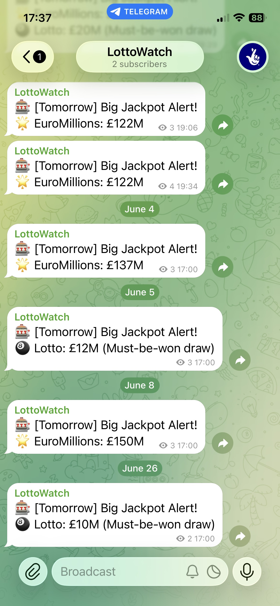

# LottoWatch

Only worth playing the lottery when the jackpot is massive. LottoWatch reminds you after work when a prize is worth going for — so you don't miss out.

Join the Telegram channel: https://t.me/lottowatch



## Schedule

Runs Monday to Thursday at 5pm UTC.

## Games

| Game | Draw Days | Avg Jackpot (180d) | Median | Max | Notifying Condition |
|------|-----------|-------------------|--------|-----|---------------------|
| EuroMillions | Tuesday, Friday | £69M | £62M | £181M | <ul><li>Jackpot ≥ £75,000,000</li></ul> |
| Lotto | Wednesday, Saturday | TBC | TBC | TBC | <ul><li>Jackpot ≥ £5,000,000</li><li>Must-be-won draw</li></ul> |

## Notifiers

| Name | When | Output |
|------|------|--------|
| Console | `--test` mode | Prints a table to stdout |
| Telegram | Scheduled runs | Sends a message to the channel |

## How to Run Locally

Install dependencies:

```bash
pip install -e .
```

Run in test mode — skips the day check and prints to console:

```bash
python main.py --test
```
